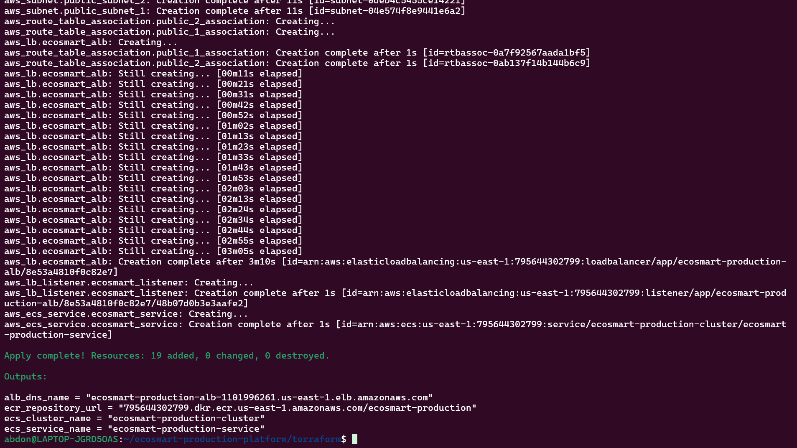
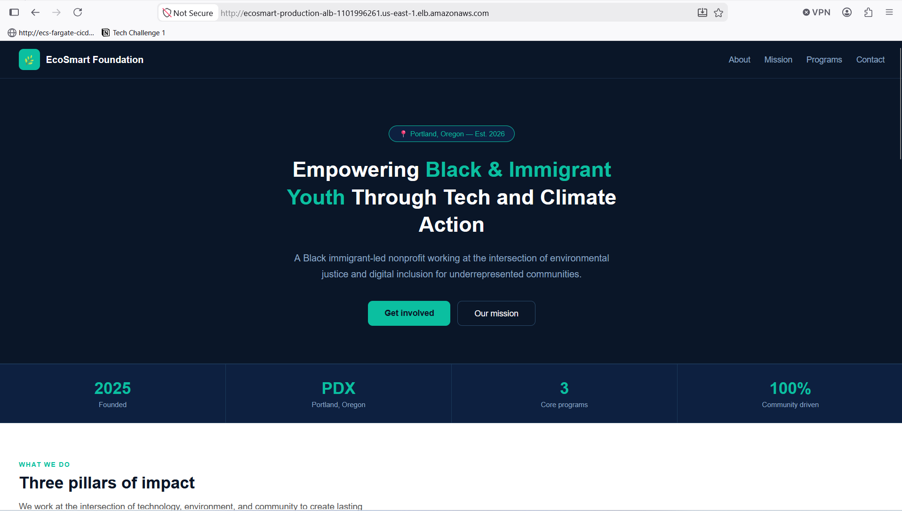
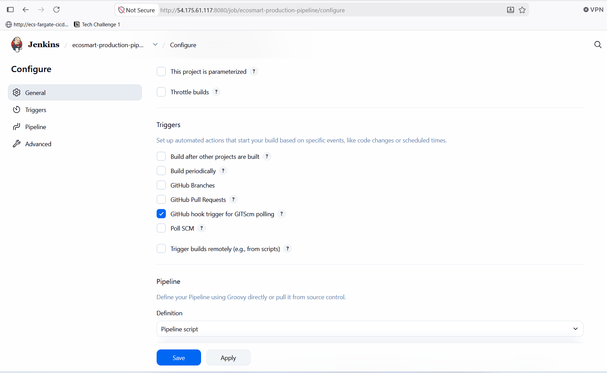
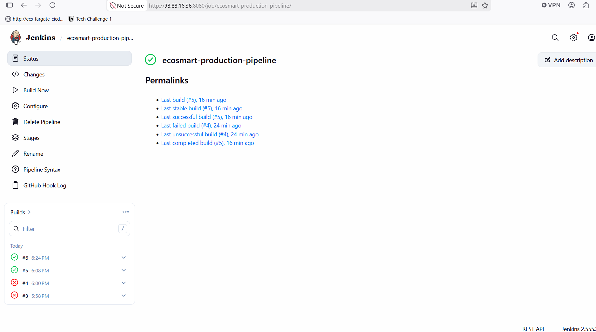
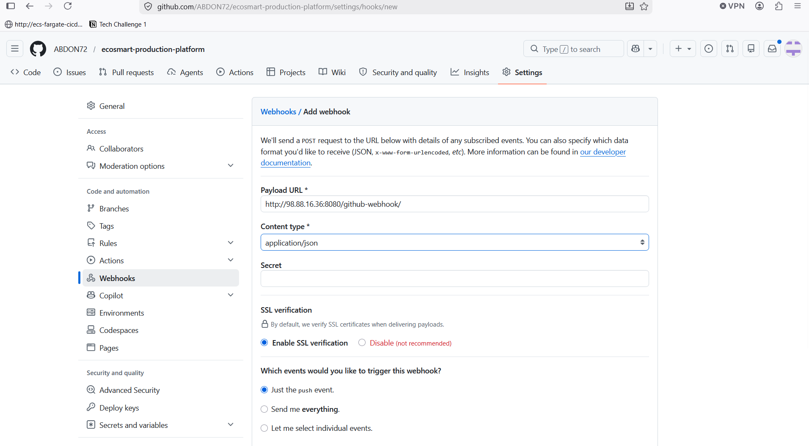
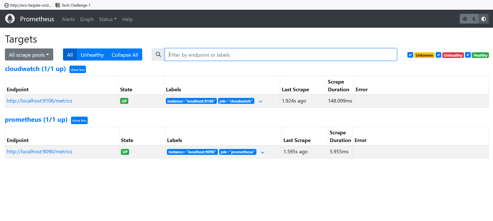
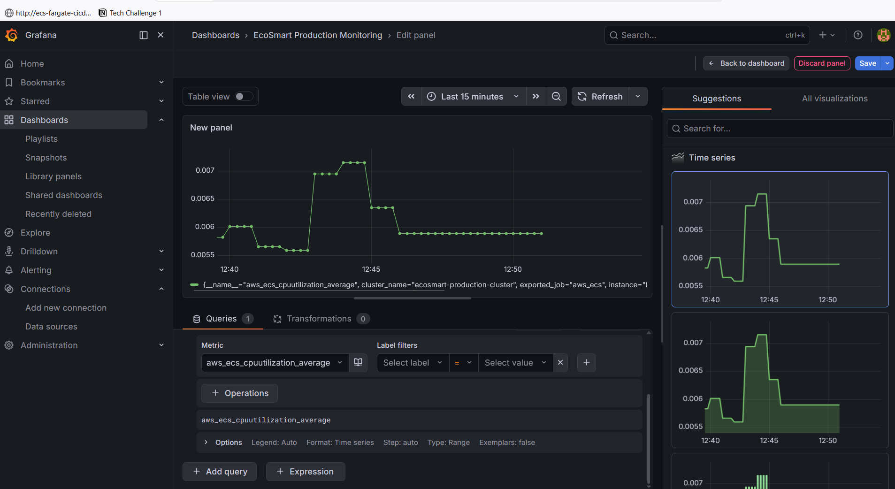

# EcoSmart Foundation — Production Cloud Deployment & Monitoring Platform 🌿🚀

A production-grade cloud deployment platform for the EcoSmart Foundation website, built using AWS, CI/CD automation, containerization, infrastructure as code, and full observability with Prometheus and Grafana.

---

## Live Resources

- **Website (ALB):** http://ecosmart-production-alb-1101996261.us-east-1.elb.amazonaws.com
- **Note:** AWS resources are spun up/down between sessions to manage cost. If the link above is not live, see the [Architecture](#architecture) section to understand how to redeploy it via Terraform + Jenkins.

---

## Project Overview

This project demonstrates how to take a simple static website and deploy it the way a real engineering team would — with proper networking, security, automated deployments, and live monitoring, instead of manually uploading files to a server.

The goal was to build a full lifecycle pipeline:

```
Code change → Git push → Automated build → Container registry → Production deployment → Live monitoring
```

---

## Architecture

```
                 GitHub Repository
                        |
                        v
                 Jenkins (EC2, CI/CD)
                        |
              -------------------------
              |                       |
        Docker Build              AWS CLI
              |                       |
              v                       v
            ECR  ---------------> ECS Fargate Service
                                       |
                                       v
                          Application Load Balancer
                                       |
                                       v
                              EcoSmart Website (Live)


        ECS Container Insights ---> CloudWatch
                                       |
                                       v
                          CloudWatch Exporter (EC2)
                                       |
                                       v
                                  Prometheus
                                       |
                                       v
                                   Grafana
                              (Live Dashboards)
```

**Networking:** Custom VPC with two public subnets across two Availability Zones, an Internet Gateway, and route tables — rather than relying on the AWS default VPC.

**Security:** Two-tier security group design — the Application Load Balancer accepts traffic from the public internet on port 80, while the ECS tasks only accept traffic from the ALB's security group, not directly from the internet.

---

## Technology Stack

| Category | Tools |
|---|---|
| Cloud Provider | AWS (EC2, ECS Fargate, ECR, ALB, VPC, IAM, CloudWatch) |
| Infrastructure as Code | Terraform |
| CI/CD | Jenkins |
| Containerization | Docker |
| Monitoring | Prometheus, Grafana, CloudWatch Exporter |
| Source Control | GitHub (with webhook-triggered builds) |

---

## Screenshots

**Infrastructure provisioned via Terraform (19 resources):**


**EcoSmart website live, served from ECS Fargate behind the ALB:**


**Jenkins CI/CD pipeline configured with GitHub webhook trigger:**


**Pipeline build history — successful automated deployments:**


**GitHub webhook configuration for zero-touch deployments:**


**Prometheus confirming both scrape targets (Prometheus itself + CloudWatch Exporter) are healthy:**


**Grafana dashboard showing live ECS CPU and memory utilization, sourced from real CloudWatch metrics:**


---

## Infrastructure (Terraform)

All infrastructure is defined as code under `/terraform`:

| File | Resources |
|---|---|
| `main.tf` | VPC, public subnets (2 AZs), Internet Gateway, route tables |
| `security.tf` | ALB security group, ECS task security group |
| `iam.tf` | ECS task execution role + policy attachment |
| `ecr.tf` | ECR repository with image scanning on push |
| `ecs.tf` | ECS cluster (Container Insights enabled), task definition, service, CloudWatch log group |
| `alb.tf` | Application Load Balancer, target group, listener |
| `outputs.tf` | ALB DNS name, ECR repo URL, cluster/service names |

Running `terraform apply` provisions all 19 resources needed for a working production environment in a single command.

---

## CI/CD Pipeline (Jenkins)

The `Jenkinsfile` defines a five-stage pipeline triggered automatically by a GitHub webhook on every push to `main`:

1. **Checkout** — pulls the latest code from GitHub
2. **Login to ECR** — authenticates Docker with Amazon ECR
3. **Build Docker Image** — builds and tags the image
4. **Push to ECR** — pushes the new image to the registry
5. **Deploy to ECS** — forces a new ECS deployment, which performs a rolling update with zero downtime

No manual steps are required after a `git push` — Jenkins handles the rest.

---

## Monitoring Stack

Real infrastructure metrics flow end-to-end:

```
ECS Fargate → CloudWatch (Container Insights)
            → CloudWatch Exporter (bridges CloudWatch → Prometheus)
            → Prometheus (scrapes + stores time-series data)
            → Grafana (dashboards)
```

Current dashboard panels track:
- ECS Service CPU utilization (live)
- ECS Service memory utilization (live)
- Prometheus / exporter self-health (`up` metric)

This setup proves the system is observable in production, not just "deployed and forgotten."

---

## Engineering Decisions

**Why ECS Fargate instead of EC2 or EKS?**
Fargate removes the need to manage and patch underlying servers while still giving full control over task definitions, scaling, and networking. EKS/Kubernetes is used in a separate project ([jenkins-eks-kubernetes-pipeline](https://github.com/ABDON72/jenkins-eks-kubernetes-pipeline)) to demonstrate both approaches.

**Why a custom VPC instead of the default VPC?**
A custom VPC with explicit subnets, route tables, and security groups demonstrates real networking control and is standard practice in production environments.

**Why self-hosted Prometheus/Grafana instead of Amazon Managed Grafana?**
Self-hosting required configuring the full scrape pipeline by hand (Prometheus config, CloudWatch Exporter, label management), which is a deeper demonstration of observability fundamentals than a managed service would provide.

---

## Troubleshooting Notes (Real Issues Solved)

This section documents real problems encountered and fixed during the build — kept here intentionally as proof of hands-on debugging, not just following a tutorial.

- **Jenkins kept crashing with no clear error.** Root cause: the EC2 instance was sized `t3.micro` (1 GB RAM), which is insufficient for Jenkins + Docker builds running concurrently. The OOM killer was silently terminating the Jenkins process. Fixed by resizing to `t3.medium` (4 GB RAM).
- **Jenkins repeatedly went offline with a "low disk space" warning** even after clearing `/tmp`. Root cause: `/tmp` was a small `tmpfs` (RAM-backed) mount. Fixed by pointing `JENKINS_HOME` and the JVM temp directory at `/opt`, which had significantly more disk headroom.
- **Large Terraform provider binaries (600+ MB) blocked GitHub pushes.** Fixed with a proper `.gitignore` and removing the files from git history with `git filter-branch`.
- **Prometheus showed "No data" for ECS metrics despite healthy scrape targets.** Root cause was an instant-query timing artifact — confirmed via the Prometheus `query_range` API that the time-series data existed correctly, then resolved by viewing the dashboard over a "Last 15 minutes" window instead of an instant point-in-time query.
- **CloudWatch Exporter's `job` label collided with Prometheus's own `job_name`.** Prometheus automatically relabeled the original value to `exported_job`, which initially caused confusion until inspected via the `/api/v1/series` endpoint.

---

## Project Structure

```
ecosmart-production-platform/
├── app/
│   └── index.html
├── terraform/
│   ├── main.tf
│   ├── security.tf
│   ├── iam.tf
│   ├── ecr.tf
│   ├── ecs.tf
│   ├── alb.tf
│   └── outputs.tf
├── Dockerfile
├── Jenkinsfile
└── README.md
```

---

## Future Improvements

- Add architecture diagram image and Grafana dashboard screenshots
- HTTPS via ACM certificate + ALB listener on port 443
- Automated tests in the pipeline (build validation, smoke tests post-deploy)
- Alerting rules in Prometheus/Grafana (e.g. notify on high CPU or failed health checks)
- Blue/green or canary deployment strategy

---

## Related Projects

- [aws-ecs-fargate-production-platform](https://github.com/ABDON72/aws-ecs-fargate-production-platform) — ECS Fargate platform with auto-scaling, load tested with Siege
- [jenkins-eks-kubernetes-pipeline](https://github.com/ABDON72/jenkins-eks-kubernetes-pipeline) — Jenkins + Docker + Kubernetes (EKS) pipeline

---

## Author

**Abdon Njunwa**
AWS Certified Solutions Architect | Cloud & DevOps Engineer
